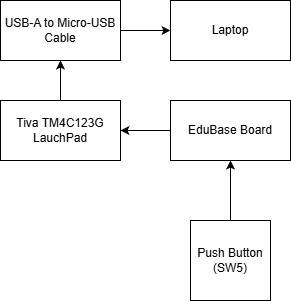

# Introduction 
This project fulgills the final project requirement for the following classes at California State University, Northridge (CSUN):
- ECE 425: Microprocessor Systems
Performed by:
-Ryan Fuentes

Professor:
Aaron Nanas

# Objective:
I have many goals that I want accomplished by the end of this project. My first goal is to create a morse decoder using GPIO input and output pins. Another major goal that I have is to expand my understanding of embedded systems. I want to be able to program the ideas that come to mind more naturally and quickly. I also want to have a stronger foundation of basic concepts for programming like setting pins, timer, interrupts etc. 

# Background and Methodology:
Embedded system concepts I plan to use for this project are GPIO input and output pins, timers, UART, and interrupts. To accomplish my project I plan to use the Keil uVision IDE and  c programming to code any system I’m using. I want to use the pins as inputs for the morse code so a quick press would be a dot, .5 seconds would be the dash, and 2 seconds could be a space for the next word. I also could have one pin as a dot and one pin as a dash. I will output the morse code using UART which will display the letters or numbers through the serial port back to my laptop. 

# Block Diagram of Design
    		 			

# Pinout Plan

| EduBase Board | Description |
| --- | --- | 
| PD0 | Push Button |
| PA0 | UART Rx | 
| PA1 | UART Tx |

# COMPONENTS USED 

| Materials | Quantity |
| --- | --- | 
| EduBase Board | 1 |
| Laptop(for programming)| 1 |

## Analysis and Results
The result of that I obtained while implementing the final project was a success. I was able to make morse decoder by using the push button to make dot and dashes and display letters and numbers. Some issues I ran into while making the final project was creating the timing after pressing the button so that it would either be a dot or dash. Sometimes, I would press the button and it would become a dash. Also holding the button too long would have no input at all. Once I changed the values for delays, then the code become easier to work with.

## Conclusion
In conclusion, I was able to have a better understanding of GPIO and UART. I learned that doing a project like this really helps my comprehension of microprocessor systems or in general, whatever the project may be. When I started this project I had no  idea that I was going to use UART and I did not know how it worked, but now I see that there can be a lot more uses for it outside of just the morse decoder. Overall, this project has helped me gain better insight on GPIO, UART, and microprocessor systems in general. 
